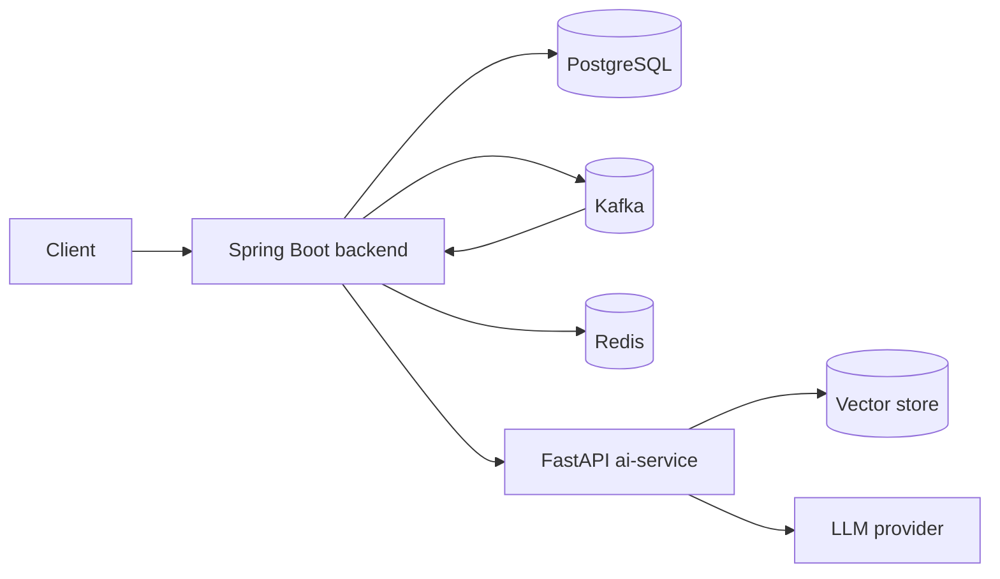

# Architecture

Two deployable services plus infrastructure.

## Parts
- **backend**: one Spring Boot app split into modules (user, order, portfolio, transaction, messaging). Owns all order and portfolio data.
- **ai-service**: Python FastAPI app for the research assistant (RAG).
- **PostgreSQL**: main database.
- **Kafka**: carries order and portfolio events between backend modules.
- **Redis**: cache for portfolio reads.

## Diagram

## Order flow (planned)
1. `POST /api/v1/orders` saves the order as CREATED.
2. An `OrderCreated` event is published.
3. A validation consumer marks it VALIDATED or REJECTED.
4. An execution consumer fills it at a simulated price, marks it EXECUTED.
5. A portfolio consumer updates positions and clears the Redis cache.

Details are in the ADRs under `docs/decisions/`.
