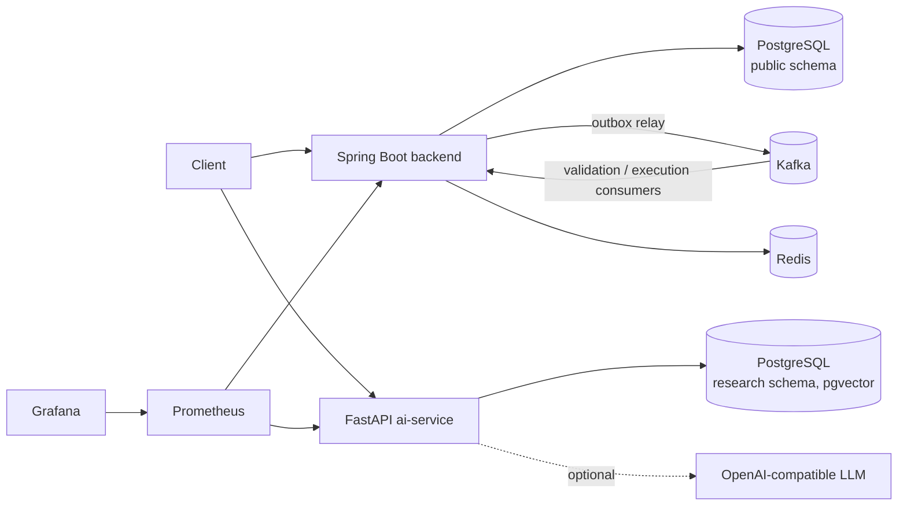

# Architecture

Two services plus infrastructure (ADR-001).

## Parts

- **backend**: one Spring Boot app split into packages `user`, `order`, `portfolio`, `messaging`, `common`.
  Owns users, orders, executions, positions and market prices (`public` schema).
- **ai-service**: FastAPI research assistant (RAG). Stores documents and chunks in the `research` schema of the
  same PostgreSQL (pgvector, ADR-005). Clients call it directly on port 8000. See docs/rag.md.
- **PostgreSQL**: source of truth for both services.
- **Kafka**: carries order events between the backend's own consumers (outbox, ADR-003).
- **Redis**: cache for portfolio reads only (ADR-004).
- **Prometheus + Grafana**: metrics and dashboard (docs/observability.md).

## System diagram

`Postgres` and `PGV` are the same server, two schemas.

## Order flow

1. `POST /api/v1/orders` validates the body, checks the idempotency key and saves the order as CREATED
   together with an `OrderCreated` outbox row (one transaction).
2. `OutboxRelay` publishes outbox rows to Kafka in batches (docs/kafka.md).
3. The `order-validation` consumer marks the order VALIDATED or REJECTED and writes the next event.
4. The `order-execution` consumer locks the position, fills the order at the synthetic market price or rejects it,
   updates the position and writes `OrderExecuted` + `PositionUpdated` (ADR-006).
5. After commit, the user's cached portfolio is evicted from Redis (docs/caching.md).

States: docs/consistency.md. Failures and retries: docs/reliability.md.
Sequence diagram: docs/kafka.md. Deployment: docs/deployment.md.
