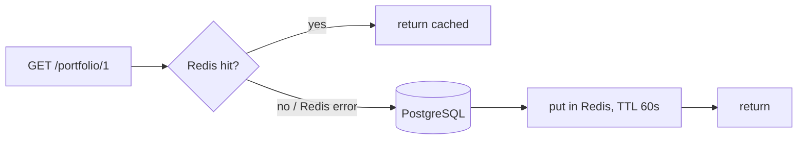

# Caching

## What is cached

Only `GET /api/v1/portfolio/{userId}`. It joins positions with market prices and is read far more often than it changes.
Everything else reads PostgreSQL directly.

| Item | Value |
|---|---|
| Store | Redis (`redis:7.4-alpine`, port 6379) |
| Pattern | cache-aside (`PortfolioCache`, `PortfolioService.getPortfolio`) |
| Key | `portfolio:v1:{userId}` (`v1` lets the JSON shape change without reading old entries) |
| Value | `PortfolioResponse` as JSON |
| TTL | 60 s (`app.cache.portfolio.ttl`) |
| Metrics | counter `portfolio.cache` with tag `result` = `hit` / `miss` / `error` (`/actuator/metrics/portfolio.cache`) |

## Flow

## Invalidation

| Change | Evicts |
|---|---|
| Order execution changes a position (`PortfolioService.buy/sell`) | that user's key |
| `PUT /market-prices/{symbol}` | keys of every user holding the symbol |

Eviction runs **after the DB transaction commits** (`TransactionSynchronization.afterCommit`).
Evicting before commit lets a concurrent reader load the old rows and put them back into the cache.
A rolled-back transaction evicts nothing (tested in `PortfolioCacheIT`).

## Known stale window

Cache-aside has one remaining race: a reader loads the old portfolio just before a commit and writes it to Redis
just after the eviction. That entry is stale until the TTL expires, so staleness is bounded by 60 s.
Accepted for a read-only view (A-016).

## Redis failures

Redis is never the source of truth. Every Redis error is caught, logged, counted as `error` and treated as a miss:

| Case | Behaviour |
|---|---|
| Redis down on read | served from PostgreSQL (tested in `PortfolioCacheRedisDownIT`) |
| Redis down on write | response still returned, entry just not cached |
| Redis down on evict | logged; entry expires by TTL |
| Slow Redis | client timeout 500 ms, then treated as down |

`/actuator/health` reports Redis as DOWN in that case, while the API keeps working.

## Not done (on purpose)

- No Caffeine in-process cache: with more than one app instance every instance would need its own invalidation.
- No stampede protection: one portfolio query is cheap; revisit only if Phase 8 benchmarks show it matters.
