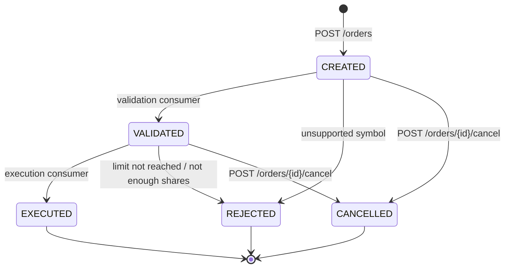

# Consistency

What is guaranteed, where, and what is only eventually consistent.

## Summary

| Area | Guarantee | Mechanism |
|---|---|---|
| Order creation | at most one order per (user, idempotency key) | `UNIQUE (user_id, idempotency_key)` + request hash |
| Order + its event | written together or not at all | transactional outbox (same DB transaction) |
| Event delivery | at least once | relay retries until Kafka acks |
| Event handling | effectively once per consumer | `processed_events` primary key, same transaction as the state change |
| Order status | only legal transitions | `OrderStatus.canMoveTo` + `version` column (optimistic lock) |
| Position update | no lost update, no oversell | row lock (`SELECT ... FOR UPDATE`) on the position during a fill |
| Portfolio read (cached) | stale for at most 60 s after a rare race | evict after commit + TTL |
| Order pipeline | eventually consistent | CREATED is returned before validation/execution happen |

## Order state machine

Source: `order/OrderStatus.java`. Any other transition throws and nothing is saved.
Two writers racing on the same order (e.g. cancel vs execution) are caught by the `version` column:
the loser gets `409 CONFLICT` (API) or retries through the Kafka error handler (consumer).

## Idempotent order placement

1. The client sends `Idempotency-Key`. The key is scoped per user (A-009).
2. Same key + same body: the first order is returned (`200`), no second order, no second event.
3. Same key + different body: `422`, detected by the stored SHA-256 of the normalised body.
4. Two concurrent requests with the same key: one insert wins, the other hits the unique constraint
   and returns the winner's order (`OrderIdempotencyIT`).

## Outbox and duplicates

The event row is inserted in the same transaction as the business change, so a committed order always
has its event and a rolled-back one never does. The relay then publishes rows in id order.

Duplicates are possible: the relay can crash after Kafka acked but before `published_at` is committed,
and a failed batch re-sends later events that may already have reached Kafka. Consumers insert
`(consumer_name, event_id)` into `processed_events` in the same transaction as their change;
a duplicate insert means "already done" and the event is skipped (`KafkaOrderFlowIT.duplicateEventIsProcessedOnlyOnce`).

## Ordering

- Topic key is `userId`, so one user's events stay on one partition and are consumed in order.
- Per-user order holds with one relay instance (A-013). Several relays with `SKIP LOCKED` could publish
  a user's events out of order.
- The async batch send checks acks in order and stops at the first failure; the idempotent producer
  keeps order within a partition. Events of one order are also causally ordered: `OrderValidated` is only
  written after `OrderCreated` was consumed.

## Cache vs database

PostgreSQL is the source of truth. The portfolio cache is evicted after commit (docs/caching.md).
One race remains: a read that loaded old rows just before a commit can write them to Redis just after the
eviction. That entry is wrong until its 60 s TTL expires (A-016).

## AI service

The research store (`research` schema) has no link to orders or portfolios. A document and all its chunks
are replaced in one transaction, so a query never sees half a document.

## Not guaranteed

- Exactly-once delivery to Kafka.
- Global order across users.
- Read-your-writes for the order pipeline: `GET /orders/{id}` right after `POST` shows CREATED.
- Fresh portfolio values during the stale window above.
