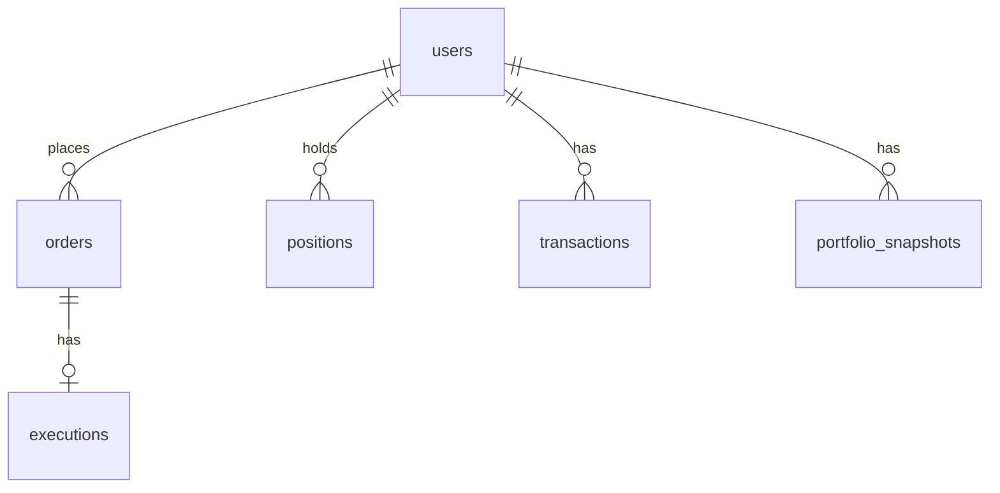

# Database

PostgreSQL. Schema changes only through Flyway migrations.

## Tables (planned)

| Table | Purpose |
|---|---|
| users | platform users |
| orders | simulated orders, one row per order |
| executions | fill details for executed orders |
| positions | current holding per user + symbol |
| transactions | user-facing history of executed trades |
| portfolio_snapshots | point-in-time portfolio value |
| processed_events | event ids already handled by each consumer |
| outbox_events | events waiting to be published to Kafka |

`documents` and `document_chunks` belong to the AI service (Phase 6).

## Relationships

## Key rules
- Money columns use `NUMERIC(19,4)`, never floating point.
- `orders` has `UNIQUE (user_id, idempotency_key)` so the same request cannot create two orders.
- `positions` has `UNIQUE (user_id, symbol)` and a `version` column for optimistic locking.
- `processed_events` has primary key `(consumer_name, event_id)` to skip duplicate events.

Exact columns are defined in the Flyway migrations in Phase 1.
