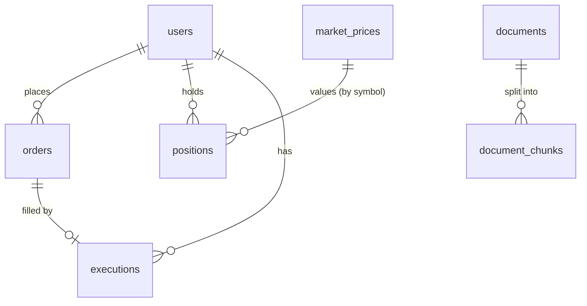

# Database

PostgreSQL 17 with pgvector. The backend's schema (`public`) changes only through Flyway migrations
in `backend/src/main/resources/db/migration` (V1-V5). The ai-service owns the `research` schema and creates it
itself (ADR-005).

## Tables

| Table | Purpose | Migration |
|---|---|---|
| users | platform users | V1 |
| orders | one row per order, status, idempotency key + request hash | V2 |
| outbox_events | events waiting to be published to Kafka | V3 |
| processed_events | event ids already handled, per consumer | V3 |
| market_prices | synthetic price per symbol (seeded) | V4 |
| positions | current holding per user and symbol | V4 |
| executions | one fill per executed order; also the trade history | V4 |
| research.documents | ingested documents with fingerprint | ai-service |
| research.document_chunks | chunks with their embedding (HNSW index) | ai-service |

There is no separate `transactions` table: `GET /users/{id}/transactions` reads `executions`.

## Relationships

`outbox_events` and `processed_events` have no foreign keys; they refer to aggregates by id in text.
`positions.symbol` matches `market_prices.symbol` by value, not by a foreign key.

## Key rules

- Money is `NUMERIC(19,4)`, never floating point.
- `orders`: `UNIQUE (user_id, idempotency_key)`; `CHECK` constraints on side, quantity, price and status.
- `executions`: `UNIQUE (order_id)` makes a double execution impossible.
- `positions`: `UNIQUE (user_id, symbol)`, `CHECK (quantity >= 0)`, `version` column; fills lock the row.
- `processed_events`: primary key `(consumer_name, event_id)` skips duplicate events.

## Indexes

| Index | Query it serves |
|---|---|
| `ix_orders_user_created (user_id, created_at DESC)` | a user's orders, newest first |
| `ix_outbox_unpublished (id) WHERE published_at IS NULL` | relay: oldest unpublished events |
| `ix_executions_user_executed (user_id, executed_at DESC)` | trade history |
| `ix_positions_symbol_user (symbol, user_id) INCLUDE (quantity)` (V5) | holders of a symbol on a price change (docs/performance.md) |
| `idx_chunks_embedding` HNSW, cosine | RAG top-k search |
