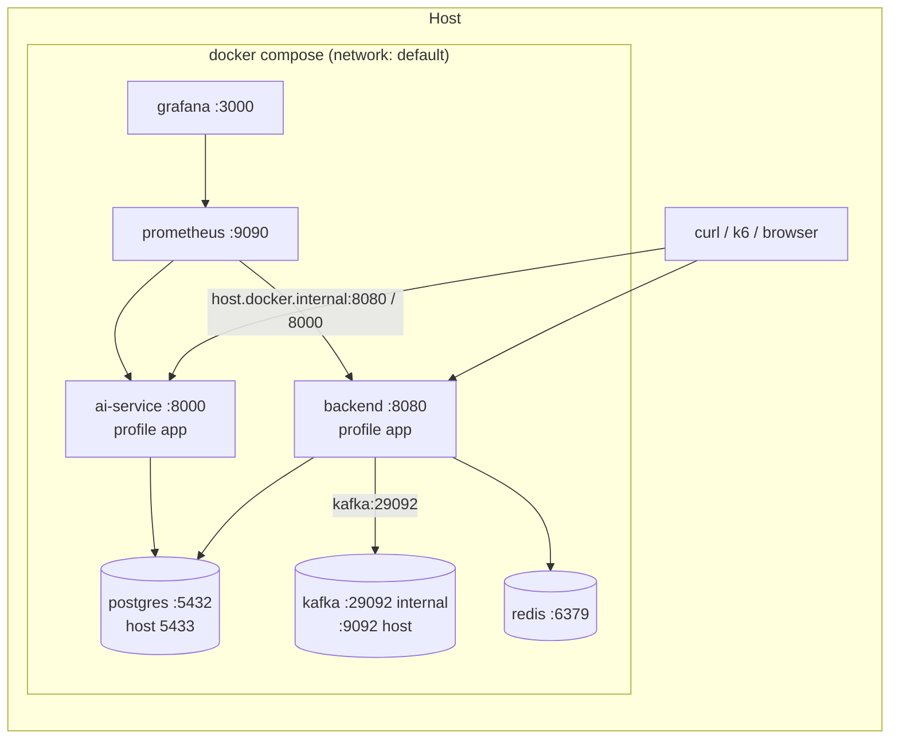

# Deployment

The only supported target is a single machine with Docker (a laptop or a CI runner).
There is no cloud deployment on purpose (plan section 23).

## Diagram

Prometheus scrapes the published host ports, so the same config works whether the apps run in Compose
or on the host (`mvn spring-boot:run`, `uvicorn`).

## Two ways to run

| Mode | Command | Apps run | Use for |
|---|---|---|---|
| Development | `docker compose up -d` | on the host | coding, debugging, benchmarks |
| Whole system | `docker compose --profile app up -d --build` | in containers | demo, smoke test, CI |

Do not mix them: both use ports 8080 and 8000.

## Images

| Image | Build | Runs as |
|---|---|---|
| backend | `maven:3.9-eclipse-temurin-21` builds the jar, `eclipse-temurin:21-jre` runs it, `-XX:MaxRAMPercentage=75` | uid 10001 |
| ai-service | `python:3.14-slim`, `pip install .`, `uvicorn --host 0.0.0.0` | uid 10001 |

Images are built in CI but not pushed anywhere.

## Configuration

Everything is an environment variable with a local default.

| Variable | Service | Default | Notes |
|---|---|---|---|
| `POSTGRES_HOST` / `POSTGRES_PORT` | both | `localhost` / `5433` | Compose sets `postgres` / `5432` |
| `POSTGRES_DB` / `POSTGRES_USER` / `POSTGRES_PASSWORD` | both | `finintel` | local only |
| `KAFKA_BOOTSTRAP_SERVERS` | backend | `localhost:9092` | Compose sets `kafka:29092` |
| `REDIS_HOST` / `REDIS_PORT` | backend | `localhost` / `6379` | |
| `APP_CACHE_PORTFOLIO_ENABLED` | backend | `true` | used for the cache-off benchmark |
| `LOGGING_STRUCTURED_FORMAT_CONSOLE` | backend | unset | `ecs` for JSON logs |
| `EMBEDDING_PROVIDER`, `LLM_PROVIDER`, `OPENAI_*` | ai-service | `hash`, `extractive` | see `ai-service/.env.example` |
| `LOG_FORMAT` | ai-service | `text` | `json` for JSON logs |
| `GRAFANA_ADMIN_PASSWORD` | grafana | `admin` | local only |

## Startup order

Compose health checks start the backend only after PostgreSQL, Kafka and Redis are healthy, and the ai-service
after PostgreSQL. On start the backend runs Flyway migrations (`public` schema) and creates Kafka topics;
the ai-service creates the `research` schema and the pgvector extension.

## Data

| Data | Where | Survives `down` | Reset |
|---|---|---|---|
| PostgreSQL | volume `pgdata` | yes | `docker compose down -v` |
| Kafka topics and offsets | container only | no | recreated by the backend |
| Redis | container only | no | cache refills on read |
| Prometheus | container only (7 d retention) | no | - |

## CI

`.github/workflows/ci.yml`: backend `mvn verify`, ai-service lint + tests on Python 3.11 and 3.14,
then a job that builds both images, starts the whole stack and runs `scripts/ci/smoke-test.sh`.
Changes to the workflow file need a token with the `workflow` scope, or an edit on github.com.
