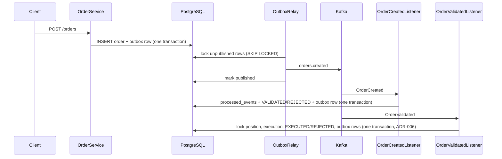

# Events and Kafka

## Flow



## Why an outbox

Writing to the DB and to Kafka in one request can half-fail. With the outbox, the order and its event are
saved in the same DB transaction. A relay (`OutboxRelay`, every 500 ms) sends unpublished rows to Kafka.
If Kafka is down, orders are still accepted and events wait in the table.

## Delivery guarantee

At-least-once. The relay can send an event twice (crash after send, before commit).
Every consumer inserts `(consumer_name, event_id)` into `processed_events` in the same transaction
as its state change. A duplicate insert does nothing, so the duplicate event is skipped.
No exactly-once claim is made.

## Event envelope

```json
{
  "eventId": "uuid",
  "eventType": "OrderCreated",
  "aggregateId": "42",
  "userId": 1,
  "occurredAt": "2026-01-01T10:00:00Z",
  "version": 1,
  "payload": { }
}
```

| eventType | payload |
|---|---|
| OrderCreated | orderId, userId, symbol, side, quantity, requestedPrice |
| OrderValidated | orderId, status, reason (null) |
| OrderRejected | orderId, status, reason |
| OrderExecuted | orderId, executionId, userId, symbol, side, quantity, price, executedAt |
| PositionUpdated | userId, symbol, quantity, avgCost |

## Topics

| Topic | Producer | Consumer (group) | Key | Partitions |
|---|---|---|---|---|
| orders.created | OrderService via outbox | order-validation | userId | 3 |
| orders.validated | order-validation via outbox | order-execution | userId | 3 |
| orders.rejected | order-validation via outbox | none yet | userId | 3 |
| orders.executed | order-execution via outbox | none yet | userId | 3 |
| portfolio.updated | order-execution via outbox | none yet (cache invalidation, Phase 5) | userId | 3 |
| orders.created.DLT | error handler | none (manual inspection) | original | 3 |
| orders.validated.DLT | error handler | none (manual inspection) | original | 3 |

Key is `userId`, so all events of one user are on one partition and consumed in order.

## Failures

| Case | Behaviour |
|---|---|
| Kafka down when relay runs | send fails fast (5 s), `attempts` + `last_error` stored, retried next run; later events wait |
| Duplicate event | skipped via `processed_events` |
| Handler error (e.g. DB down) | 3 attempts, 1 s apart, then `orders.created.DLT` |
| Malformed JSON / missing envelope fields | no retry, straight to DLT |
| Order cancelled before validation/execution | event marked processed, order left CANCELLED |
| SELL without enough shares / limit not reached | order REJECTED with a reason in the OrderRejected event |

## Local run

`docker compose up -d` starts PostgreSQL (5433) and Kafka (9092, KRaft, single broker).
