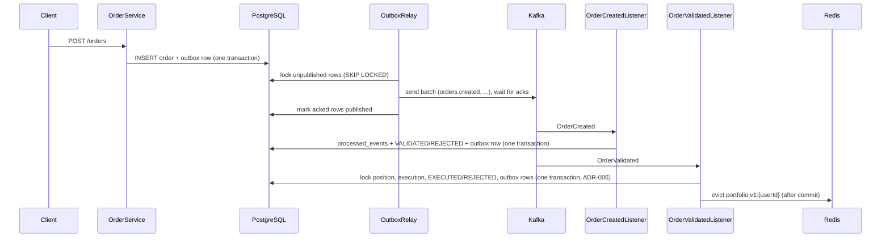

# Events and Kafka

## Flow



## Why an outbox

Writing to the DB and to Kafka in one request can half-fail. With the outbox, the order and its event are
saved in the same DB transaction. A relay (`OutboxRelay`) sends unpublished rows to Kafka.
If Kafka is down, orders are still accepted and events wait in the table.

How the relay runs (`OutboxScheduler`, `app.outbox.publisher.*`):

- every 500 ms it locks up to 100 unpublished rows (`FOR UPDATE SKIP LOCKED`, oldest first);
- sends the whole batch without waiting per event, then checks the acks in order;
- marks acked rows published and stops at the first failure; later rows stay unpublished and are sent again;
- while batches come back full it repeats, up to 20 batches per run.

Before Phase 8 it sent one event at a time and waited for each ack, which capped the pipeline at about
90-100 events/s (docs/performance.md).

## Delivery guarantee

At-least-once. The relay can send an event twice: a crash after the send but before the commit, or a failed
batch whose later events had already reached Kafka.
Every consumer inserts `(consumer_name, event_id)` into `processed_events` in the same transaction
as its state change. A duplicate insert does nothing, so the duplicate event is skipped.
No exactly-once claim is made.

## Event envelope

```json
{
  "eventId": "uuid",
  "eventType": "OrderCreated",
  "aggregateId": "42",
  "userId": 1,
  "occurredAt": "2026-01-01T10:00:00Z",
  "version": 1,
  "payload": { },
  "requestId": "3f1c9a2e-..."
}
```

`requestId` is the id of the HTTP request that started the chain (docs/observability.md).
Consumers put it back into the log context, and every event they emit carries it again.
It is optional: events without it still parse (added after version 1, backward compatible).

| eventType | payload |
|---|---|
| OrderCreated | orderId, userId, symbol, side, quantity, requestedPrice |
| OrderValidated | orderId, status, reason (null) |
| OrderRejected | orderId, status, reason |
| OrderExecuted | orderId, executionId, userId, symbol, side, quantity, price, executedAt |
| PositionUpdated | userId, symbol, quantity, avgCost |

## Topics

| Topic | Producer | Consumer (group) | Key | Partitions |
|---|---|---|---|---|
| orders.created | OrderService via outbox | order-validation | userId | 3 |
| orders.validated | order-validation via outbox | order-execution | userId | 3 |
| orders.rejected | order-validation via outbox | none yet | userId | 3 |
| orders.executed | order-execution via outbox | none yet | userId | 3 |
| portfolio.updated | order-execution via outbox | none yet (cache is evicted in-process after commit, see caching.md) | userId | 3 |
| orders.created.DLT | error handler | none (manual inspection) | original | 3 |
| orders.validated.DLT | error handler | none (manual inspection) | original | 3 |

Key is `userId`, so all events of one user are on one partition and consumed in order.

## Failures

| Case | Behaviour |
|---|---|
| Kafka down when relay runs | send fails fast (5 s block, 10 s delivery), first failed row gets `attempts` + `last_error`, retried next run; later rows stay unpublished |
| Duplicate event | skipped via `processed_events` |
| Handler error (e.g. DB down) | 3 attempts, 1 s apart, then `<topic>.DLT` |
| Malformed JSON / missing envelope fields | no retry, straight to DLT |
| Order cancelled before validation/execution | event marked processed, order left CANCELLED |
| SELL without enough shares / limit not reached | order REJECTED with a reason in the OrderRejected event |

## Local run

`docker compose up -d` starts PostgreSQL (5433), Kafka (KRaft, single broker) and Redis (6379).
Kafka listens on `localhost:9092` for apps on the host and `kafka:29092` for containers (docs/deployment.md).
