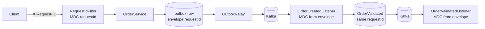

# Observability

Goal (Phase 7 gate): one request can be followed across every component it touches.

## Request id



- HTTP: `RequestIdFilter` (backend) and `RequestIdMiddleware` (ai-service) take the client's `X-Request-ID`
  if it matches `[A-Za-z0-9._-]{1,100}`, otherwise create a UUID. It is echoed in the response header and in error bodies.
- Events: `OutboxWriter` copies the current request id into the event envelope. The listeners put it back into the
  log context while they handle the event, so the events they emit carry it too.
- The outbox relay runs on a scheduler thread, so its own log lines have no request id; they name the event id.

Why not distributed tracing yet: see ADR-008.

## Follow one order

```powershell
curl.exe -X POST http://localhost:8080/api/v1/orders -H "Content-Type: application/json" -H "Idempotency-Key: trace-demo-1" -H "X-Request-ID: trace-demo-1" -d "{\"userId\":1,\"symbol\":\"ACME\",\"side\":\"BUY\",\"quantity\":1,\"price\":200}"
```

Every backend log line for this order then contains `[trace-demo-1]` (example, values will differ):

```text
... [trace-demo-1] c.s.finintel.order.OrderService : Order 5 created: BUY 1 ACME for user 1
... [trace-demo-1] c.s.finintel.common.RequestIdFilter : POST /api/v1/orders -> 201 in 35 ms
... [trace-demo-1] c.s.f.order.OrderValidationService : Order 5 validated
... [trace-demo-1] c.s.f.order.OrderExecutionService : Order 5 executed: BUY 1 ACME at 100.0000
```

## Logs

| Service | Default | Structured JSON |
|---|---|---|
| backend | text, `[requestId]` after the level | `LOGGING_STRUCTURED_FORMAT_CONSOLE=ecs` (Spring Boot built-in, includes MDC fields) |
| ai-service | text, `[requestId]` | `LOG_FORMAT=json`: `timestamp, level, service, logger, requestId, message, error` |

Each HTTP request also gets one access line: method, path, status, duration.
Backend skips `/actuator/*` and ai-service skips `/metrics`, since Prometheus calls them every few seconds.

## Metrics

Backend: `/actuator/prometheus`. ai-service: `/metrics`. Both in Prometheus text format.

| Plan item | Metric | Source |
|---|---|---|
| HTTP count, errors, latency | `http_server_requests_seconds_*` (tags `uri`, `status`, `outcome`) | Spring Boot |
| DB query latency | `spring_data_repository_invocations_seconds_*` (per repository method) and `hikaricp_connections_*` | Spring Boot |
| Kafka consumer lag | `kafka_consumer_fetch_manager_records_lag_max` | Kafka client metrics via Spring Boot |
| Kafka processing | `spring_kafka_listener_seconds_*` (tag `error`), `kafka_dead_letter_total{topic}` | listener observation, `KafkaConfig` |
| Kafka publishing | `outbox_publish_total{result}`, `outbox_pending` | `OutboxRelay` |
| Redis hit/miss | `portfolio_cache_total{result=hit,miss,error}` | `PortfolioCache` |
| RAG requests | `rag_queries_total{answer_type}`, `rag_documents_ingested_total{result}` | ai-service |
| AI retrieval latency | `rag_retrieval_duration_seconds_*` | ai-service |
| LLM latency and errors | `rag_generation_duration_seconds_*{provider}`, `rag_llm_errors_total{provider}` | ai-service |
| ai-service HTTP | `http_requests_total{method,route,status}`, `http_request_duration_seconds_*` | ai-service |

Latency metrics are histograms, so p50/p95/p99 can be computed in Prometheus.
Label values are bounded: route templates (not raw paths), fixed result/answer types.

`outbox_pending` runs a `count(*)` on the partial index of unpublished rows at each scrape.

## Not done yet

- Prometheus and Grafana containers with a dashboard (next step, after these metrics are checked by hand).
- Distributed tracing (ADR-008).
