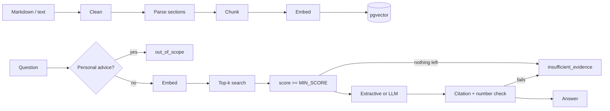

# Research assistant (RAG)

Python FastAPI service in `ai-service/`. It answers questions about stored documents, and every answer
points to the exact chunks it came from. If the evidence is weak, it says so instead of guessing.

## Pipeline

## Ingestion

| Step | What it does |
|---|---|
| Clean | CRLF to LF, drop HTML comments and control characters, collapse blank lines. Never changes words or numbers. |
| Parse | Markdown headings become sections. H1 is the title; H2+ build a path like `Segment results > Software`. |
| Chunk | Paragraphs packed up to `CHUNK_MAX_CHARS` (800). Long paragraphs split on sentences. A chunk never crosses a section, so it has one exact location. No overlap yet. |
| Embed | Title + section + text are embedded together, in batches of 64. |
| Store | Document row + all chunks replaced in one transaction. |

Chunk metadata: `document_id`, `chunk_id` (`<document_id>:<index>`), `title`, `source`, `section`, `created_at`.
Location is the section path. Markdown has no pages, so no page numbers are ever shown.

Re-ingesting is idempotent: a fingerprint (SHA-256 of title, source, chunk size, embedding model and text)
is stored per document. Same fingerprint means nothing is re-embedded (API returns 200 instead of 201).

## Storage (ADR-005)

Schema `research` in the same PostgreSQL as the backend; the AI service creates it on startup
(`CREATE ... IF NOT EXISTS`). The backend's Flyway only manages `public`.

| Table | Key columns |
|---|---|
| `research.documents` | `document_id` PK, `title`, `source`, `fingerprint`, `embedding_model` |
| `research.document_chunks` | `chunk_id` PK, `document_id` FK (cascade), `chunk_index`, `section`, `content`, `embedding vector(N)` |

- HNSW index with cosine distance. Approximate, but exact on this tiny data set (an integration test compares it with exact in-memory search).
- Search only looks at chunks whose document was embedded with the current model, so mixing models never returns nonsense scores.
- `vector(N)` is fixed when the table is created. Starting with a different `EMBEDDING_DIM` fails fast with a clear message: drop the `research` schema and re-ingest.
- Concurrent ingests of one document: the document upsert locks its row, so they run one after the other and never mix chunks (integration test).

## Providers (ADR-007)

| Setting | Options |
|---|---|
| `EMBEDDING_PROVIDER` | `hash` (default, offline, lexical) or `openai` (any OpenAI-compatible `/embeddings`) |
| `LLM_PROVIDER` | `extractive` (default, no LLM) or `openai` (any OpenAI-compatible `/chat/completions`, temperature 0) |

Business code only sees `EmbeddingClient` and `LLMClient`. `app/services.py` picks the implementation from settings.

## Answer rules

| Answer type | When |
|---|---|
| `out_of_scope` | question asks for personal buy/sell/allocation advice (regex, checked before retrieval) |
| `insufficient_evidence` | no chunk scores at least `MIN_SCORE`, the LLM says `INSUFFICIENT_EVIDENCE`, or the LLM answer fails the checks below |
| `extractive` | no LLM: the 1-2 source sentences sharing the most words with the question, copied verbatim with `[n]` |
| `generated` | LLM answer that passed the checks |

Checks on LLM answers (`generation/citations.py`):

- Citations `[n]` must point to a source that was actually given. Invalid ones are removed; no valid citation means rejection.
- Every number in the answer must appear in a cited source (or in the question). Otherwise rejected.
- `sources` in the response only lists cited chunks. `snippet` is the stored chunk text, never generated.

Known limits: the checks do not prove every sentence is supported, only that citations are real and numbers are traceable.
The advice filter is a small regex list, not a classifier.

## Failure behaviour

| Case | Behaviour |
|---|---|
| LLM timeout / error | 503 `LLM_UNAVAILABLE`, no fallback answer. Timeout `LLM_TIMEOUT_SECONDS` (30 s). |
| Embedding API error | 503 `EMBEDDING_UNAVAILABLE` |
| PostgreSQL down | 503 `DATABASE_UNAVAILABLE` within 5 s (pool timeout). Dead connections are checked and replaced, so it recovers after a DB restart without an app restart. |
| PostgreSQL down at startup | service does not start (schema cannot be checked) |
| Bad request | 400 `VALIDATION_ERROR`, same error shape as the backend, with `requestId` |
| Empty document | 422 `EMPTY_DOCUMENT` |

Every response carries `X-Request-ID` (incoming value reused if it looks safe), and log lines include it.

## Not done yet

- PDF parsing, chunk overlap, reranking, hybrid (keyword + vector) search.
- The backend does not call the AI service yet; clients call it directly on port 8000.
