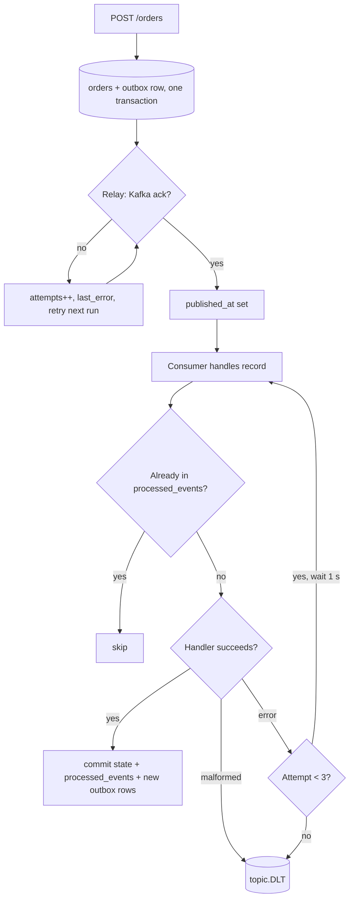

# Reliability

How each failure is handled and where it is tested. Retries exist only in the three places listed below.

## Retries

| What is retried | Why | Max attempts | Backoff | After the last failure |
|---|---|---|---|---|
| Outbox publish to Kafka (`OutboxRelay`) | Kafka may be briefly down; the order is already committed | unlimited, one try per scheduler run | fixed: next run after 500 ms; send timeout 10 s | row keeps `attempts` + `last_error`, `outbox.pending` grows; see runbook "Outbox backlog" |
| Kafka producer send (client) | transient broker errors | until `delivery.timeout.ms` = 10 s | Kafka client default (100 ms, max 1 s) | send fails, relay handles it (row above) |
| Kafka consumer record (`DefaultErrorHandler`) | a handler may hit a transient DB error or lock conflict | 3 (1 + 2 retries) | fixed 1 s | record goes to `<topic>.DLT`, counter `kafka.dead.letter` |

Not retried on purpose:

- **Malformed events**: can never succeed, go straight to the DLT (`MalformedEventException`).
- **HTTP requests**: the client retries; `Idempotency-Key` makes retrying `POST /orders` safe.
- **Redis**: every error is a cache miss; retrying would only add latency.
- **LLM and embedding calls**: one attempt with a timeout, then `503`. The client decides whether to ask again.

Backoff is fixed, not exponential. With 3 attempts 1 s apart the extra load is small, and a longer
outage (DB down) ends up in the DLT either way. Exponential backoff would matter with many retries or many clients.

## Failure / retry flow

## Failure matrix

| Failure | Behaviour | Timeout | Tested in |
|---|---|---|---|
| Invalid API input | `400` / `422` in the standard error body, nothing stored | - | `OrderControllerTest`, `UserControllerTest`, `test_api.py` |
| Duplicate order request | first order returned, no second order or event | - | `OrderIdempotencyIT` |
| Duplicate Kafka event | skipped via `processed_events` | - | `KafkaOrderFlowIT.duplicateEventIsProcessedOnlyOnce` |
| Malformed Kafka message | sent to `.DLT` without retries | - | `KafkaOrderFlowIT.malformedMessageGoesToDeadLetterTopic` |
| Kafka unavailable (publish) | orders still accepted; events wait in the outbox | 5 s (`max.block.ms`), 10 s send | `OutboxRelayTest` (unit, mocked broker) |
| Kafka consumer restart | resumes from the last committed offset; replayed records are duplicates and skipped | - | covered by the duplicate-event test; no restart test yet |
| Redis unavailable | served from PostgreSQL; health shows Redis DOWN | 500 ms | `PortfolioCacheRedisDownIT`, `PortfolioCacheTest` |
| PostgreSQL unavailable (backend) | request fails with `500 INTERNAL_ERROR` after the pool timeout; consumers retry then DLT | Hikari default 30 s | not tested |
| PostgreSQL unavailable (ai-service) | `503 DATABASE_UNAVAILABLE`; dead pooled connections are checked before use | 5 s pool timeout | handler only, no test with a stopped DB |
| LLM unavailable / timeout | `503 LLM_UNAVAILABLE`, no made-up answer | `LLM_TIMEOUT_SECONDS` (30 s) | `test_openai_llm.py`, `test_api.py::test_llm_failure_is_503` |
| Embedding provider unavailable | `503 EMBEDDING_UNAVAILABLE` | 30 s | `test_embeddings.py` |
| Concurrent status change | optimistic lock: API `409`, consumer retried | - | `OrderLifecycleIT.staleUpdateIsRejectedByVersionCheck` |
| SELL racing another SELL | position row locked during the fill (`findForUpdate`), holdings checked under the lock | - | not enough shares: `KafkaOrderFlowIT.sellWithoutSharesIsRejected`; no concurrent-sell test |
| Unexpected exception | `500` in the standard body with the request id, stack trace only in the log | - | `test_api.py::test_unexpected_error_is_500_in_standard_shape` |

## Known gaps

- No automated test stops PostgreSQL or Kafka mid-run; those paths are covered by unit tests and handlers only.
- No automatic DLT replay. Records are inspected and re-published by hand (docs/runbooks.md).
- Backend DB timeout is the Hikari default (30 s), so a DB outage makes API calls slow before they fail.
- One relay instance, one consumer thread per group (A-013, docs/performance.md).
